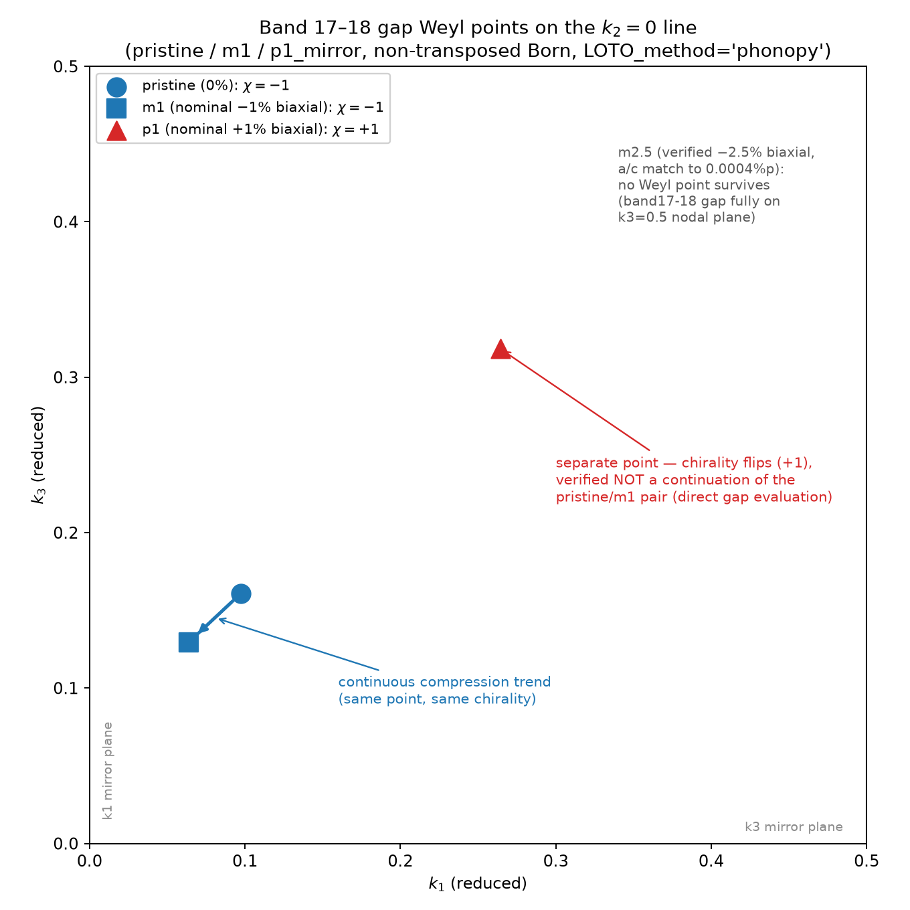

# Band 17-18 Weyl point 위치 및 strain 추이 (요약)

k2=0 선상(band17-18 gap)에서 확인된 Weyl point 좌표와, strain에 따른 이동 추이.

## strain 라벨 상세 (biaxial 표기 + 실측 비등방 파라미터)

라벨은 관례대로 "biaxial ±%"를 쓰되, 실제로는 거울축(a,c) 두 축이 정확히 같은 비율로
strain되지 않은 경우가 있어 실측값을 병기한다. b(또는 해당 구조의 편극축)는 고정하지
않고 자유 relax한 값.

| 구조 | 라벨 | a축(거울) 실측 | c축(거울) 실측 | a/c 불일치 | 편극축(자유) 실측 | band17-18 Weyl (k2=0) |
|---|---|---|---|---|---|---|
| pristine | 0% | - | - | - | - | (0.09752, 0, 0.16103), χ=−1 |
| m1 | биaxial −1%(nominal) | −0.844% | −0.687% | 0.157%p (상대 22.9%) | +0.514% | (0.06377, 0, 0.12942), χ=−1 |
| p1 | biaxial +1%(nominal) | +1.159% | +1.320% | 0.160%p (상대 12.1%) | −0.754% | (0.26434, 0, 0.31821), χ=+1 |
| m2.5 | biaxial −2.5%(검증됨) | −2.4982% | −2.4977% | 0.0004%p (상대 0.0%) | +1.854% | 없음 (전부 χ=0, k3=0.5 nodal plane 위) |

**m1, p1은 "biaxial"이라는 라벨과 달리 두 거울축(a,c) strain이 서로 다르다** (12~23%
상대 불일치). 반면 m2.5는 a,c가 소수점 4자리까지 일치하는 순수 biaxial이다. 출처(동료
제공)의 relax 조건이 pristine/m1/p1과 m2.5 사이에 달랐을 가능성이 있어, m1·p1 계열을
"단일 biaxial strain 축 위의 점들"로 취급해 외삽/추세 해석을 하는 것은 근거가 약하다.

## 플롯이 보여주는 것

- **pristine → m1 (파란 실선)**: 같은 물리적 Weyl point가 압축에 따라 Γ 쪽으로 연속적으로
  이동 (χ=−1로 동일 부호 유지, 직접 대조로 확인됨). 이 방향으로 더 압축하면 이미 확인된
  대로 m2.5 근방에서 소멸한다.
- **p1의 점 (빨간 삼각형)**: pristine/m1 pair와 **무관한 별개의 점** (χ=+1로 부호가 다르고,
  pristine/m1 좌표에서 직접 계산한 gap이 각각 0.245, 0.301 THz로 열려 있어 연속된 점이
  아님을 확인함). 인장 쪽에서 나타난 것으로 보이나, 정확한 발생 strain은 추가 계산 없이는
  모른다.
- **m2.5 (주석)**: 참고용 — band17-18 gap에서 Weyl point가 전혀 남지 않고, k3=0.5 nodal
  plane(대칭보호, χ=0)만 존재.
