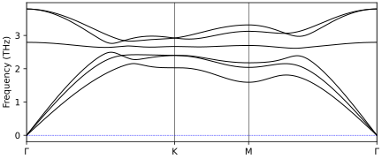
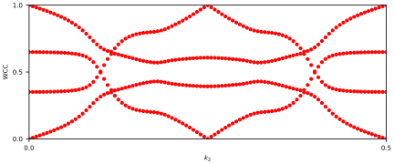
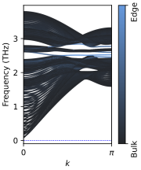
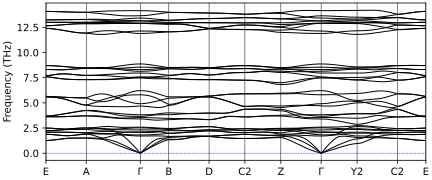
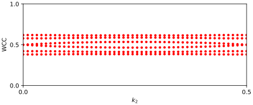
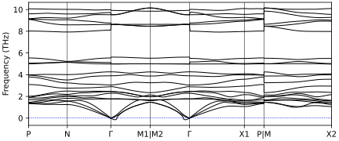
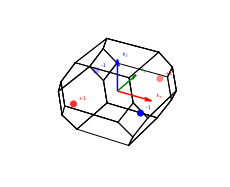
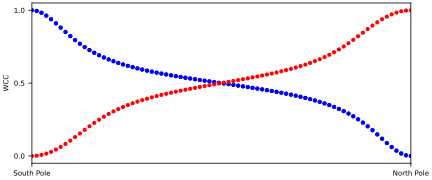
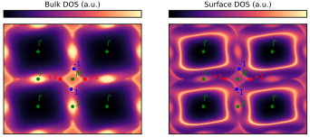

<a name="readme-top"></a>

<div align="center">


<h1 align="center">Welcome to Simphony!</h3>
 <h3 align="center"><ins>SIM</ins>ulated <ins>PHON</ins>on topolog<ins>Y</ins></h3>

Simphony is an open-source software package designed for the topologi-
cal analysis of lattice vibrations based on Wannier tight-binding models. Its primary function is to classify the topology of novel materials by computing bulk and slab phonon band structures, extracting phonon surface spectra, and providing analysis tools such as Wilson loop calculations and Weyl node
detection.

</div>

<!-- Index -->
<details>
  <summary>Table of Contents</summary>
  <ol>
    <li>
      <a href="#installation">Installation</a></li>
    </li>
    <li>
      <a href="#how-to-use-simphony">How to use Simphony</a>
    </li>
    <li>
	<a href="#capabilities">Capabilities</a>
    </li>
    <li><a href="#examples">Examples</a></li>
    <li><a href="#roadmap">Roadmap</a></li>
  </ol>
</details>


## Installation

### Prerequisites

To install Simphony you need the following basic requirements:
<ol>
    <li> A Unix-based operating system </li>
    <li> A Fortran compiler: gfortran or ifort </li>
    <li> Lapack and Blas libraries </li>
    <li> OPTIONAL: an MPI-enabled Fortran90 compiler for parallel execution </li>
</ol>

### Compilation

To compile Simphony, clone the repository wherever you want your installation to be, using:
```
> git clone https://github.com/fballestermacia/simphony.git
```
or download the zip file directly from the [github repository](https://github.com/fballestermacia/simphony).

The code can be compiled using the standard Makefilelocated in the *simphony/src* directory, which is compatible with most architectures. Additional template Makefiles are provided for specific architectures, and users may modify them as needed. To compile the code, run the following command from the *simphony/src* directory

```
> make
```

Then, inside the *simphony/bin* directory, an executable file named *pn.x* should appear. 

It is recommended to add the *simphony/bin* folder to your PATH by including the following line

```
export PATH=PATHTOYOURSimphonyINSTALLATION/simphony/bin:$PATH
```
in your *.bashrc* file in your home directory.

With that, the code is ready to go! Check the <a href="#how-to-use-simphony">How to use Simphony</a> section for more details on running the program.


## How to use Simphony
Running Simphony requires only two input files: a *wannier90_hr.dat*
file, which contains all the information about the dynamical matrix needed
to build the tight-binding model (following the format described in Wannier90), and a *pn.in* file, which provides system details, instructions, and simulation parameters.

The *wannier90_hr.dat* file contains the hopping parameters of the TB
model in real space, with the long-range dipole-dipole interaction subtracted for the case of polar materials. An executable Python script called *QE2TBDAT* can be found inside the *simphony/utility_scripts* directory to read the output of a QuantumESPRESSO *ph.x* run and automatically generate the corresponding *wannier90_hr.dat* file using SSCHA codes CellConstructor package.

The pn.in file is structured in namelists and cards. The main namelists
of Simphony are:
<ul>
    <li> <i>&TB_FILE</i> : Indicates the name of the <i>wannier90_hr.dat</i> file.</li>
    <li><i>&CONTROL</i> : LetsSimphony know which subroutines to run.</li>
    <li><i>&SYSTEM</i> : Includes parameters when building the system, such as the number of layers in the slab or the number of bands to include in the WCC calculation.</li>
   <li><i>&PARAMETERS</i> : Parameters of the simulation, such as the number of points in the grid in reciprocal space or energy range on which to compute the spectral function.</li>
</ul>

The complete list of available routines included in Simphony is:
<ul>
    <li><i>LOTO_correction</i>: whether to include LO-TO splitting.</li>
    <li><i>BulkBand_calc</i>: calculate the bulk band structure along a high-symmetry path.</li>
    <li><i>BulkBand_plane_calc</i>: calculate the bulk band structure in a plane.</li>
    <li><i>BulkGap_cube_calc</i>: calculate the energy gap between two bands on a 3D grid of q-points.</li>
    <li><i>BulkGap_plane_calc</i>: calculate the energy gap between two bands in a plane. </li>
    <li><i>SlabBand_calc</i>: construct a slab Hamiltonian and compute its band structure along a path.</li>
    <li><i>SlabSS_calc</i>: compute the surface spectral function along a path within an energy window.</li>
    <li><i>SlabArc_calc</i>: compute the surface spectral function on a constant-energy isosurface.</li>
    <li><i>WireBand_calc</i>: construct a ribbon Hamiltonian and compute the band structure.</li>
    <li><i>Dos_calc</i>: compute the density of states (DOS) within an energy window.</li>
    <li><i>FindNodes_calc</i>: locate gapless points between two bands.</li>
    <li><i>BerryPhase_calc</i>: compute the Berry phase along a closed loop in the 3D Brillouin zone.</li>
    <li><i>BerryCurvature_calc</i>: compute the Berry curvature in a 2D plane.</li>
    <li><i>Chern_3D_calc</i>: compute the Wannier charge centers (WCCs) along various planes.</li>
    <li><i>Wanniercenter_calc</i>: compute WCCs in a specified plane.</li>
    <li><i>WeylChirality_calc</i>: compute WCCs on a sphere centered at a given point to determine Weyl node chirality.</li>
</ul>

Another Python script, called *createSimphonyInput* and included in Simphony, automatically generates the pn.in file from the output of a QuantumESPRESSO ph.x run. The cards in the pn.in file are routine-dependent, and general default values for these cards are generated by the *createSimphonyInput* script. Some cards are required for most subroutines, such as *LATTICE*, *ATOMS*, and *KPATH_BULK*.

The *LATTICE* card is structured as follows
```
LATTICE
Angstrom or Bohr
a1
a2
a3
```

The *ATOMS* card has the following format:
```
ATOMS
Number of Atoms
Direct or Cartesian
Symbol mass (in a.u.) position
Symbol mass (in a.u.) position
...
```

And the *KPATH_BULK* card is:
```
KPATH_BULK
Number of segments
Start_label1 coordinates (direct) End_label1 coordinates (direct)
Start_label2 coordinates (direct) End_label2 coordinates (direct)
Start_label3 coordinates (direct) End_label3 coordinates (direct)
...
```

Examples of various input files can be found in the *simphony/examples*
directory.

Then, inside a folder containing both input files, the Simphony executable
can be run as follows:
```
pn.x
```
or in multiprocessor mode
```
mpirun -np 4 pn.x
```

Afterward, Simphony will generate several output files in the current directory. The main output file, *PN.out*, contains information about the run and how Simphony interpreted the input files. Additionally, depending on the calculations performed, other files will be produced, primarily *.dat* and *.gnu* files. The former contains the numerical data resulting from the calculations, conveniently structured for plotting, while the latter consists of scripts used by gnuplot to quickly visualize the *.dat* files.


## Examples

To illustrate the usage of Simphony, we present a simple Buckled Honeycomb Lattice model along with two real materials, using example input files
for the calculation of their topological properties. All necessary files can be found in the *simphony/examples* directory

### Buckled Honeycomb Lattice

The buckled honeycomb lattice (BHL) model can present non-trivial sets
of bands when considering third-nearest neighbor couplings. To showcase the usage of Simphony we construct a simple BHL model up to third nearest-neighbor couplings. According to topological quantum
chemistry this system is trivial, but numerical calculations show a non-zero winding number in the Wilson loop, which indicates a topological phase.

We compute the bulk dispersion, Wannier charge center and ribbon dis-
persion in one single run of Simphony. To do so, we set the &CONTROL namelist with the following variables set to true:

```
&CONTROL
BulkBand_calc = T
Wanniercenter_calc = T
WireBand_calc = T
/
```

This tells Simphony which calculations to perform, but the program still
requires the specific parameters for the simulation. An example of such
an input file can be found in the *simphony/examples/BHL* directory. The
following calculation-specific parameters must also be included in the input file:

```
&SYSTEM
NSLAB1 = 40
NSLAB2 = 1
NumOccupied = 4
/
&PARAMETERS
Nk1 = 150
Nk2 = 150
/
KPLANE_BULK
0.00 0.00 0.00 ! Original point for 3D k plane
1.00 0.00 0.00 ! The first vector to define 3d k space plane
0.00 1.00 0.00 ! The second vector to define 3d k space plane
MILLER_INDEX
1 0 0
```

For the calculation of the bulk band structure, the only required parameter is the number of points per segment, specified by the Nk1 variable. The Wannier center subroutine requires a grid of points in a plane of reciprocal space, defined by Nk1 and Nk2. The NumOccupied variable specifies the number of occupied bands to be considered, from the first up to the NumOccupied-th band, for the WCC calculation. This subroutine also needs a plane on which to define the grid, provided via the *KPLANE_BULK* card.

For the ribbon band structure, Nk1 defines the number of points along the
1D Brillouin zone, and a surface must be specified using the *MILLER_INDEX*
card. To construct the ribbon geometry, the unit cell is repeated NSLAB1
times along the non-periodic direction and NSLAB2 times along the periodic
direction.

In case some parameters are missing from the input file, Simphony uses
some default values that might not be appropriate for all calculations. All
details regarding the parameters used are found in the *PN.out* output file.

The bulk band calculation results in



The WCC calculation considering the lower four bands is



which indicates a non-trivial winding. 

Then, by plotting the ribbon band structure, we see the edge states



### Surface states on an Obstructed Atomic Band Representation: $\text{AgP}_2$ 

$\text{AgP}_2$ is an insulator belonging to space group $P2_1/c$ (No. 14), thus, in the *&CONTROL* namelist we must include:

```
LOTO_correction       = T
```
for all calculations.

For this example, we will calculate the bulk bands of the system, the Wilson loop of an *OABR* band and the band structure of the surface state originated from the *OABR*. Thus, our full *&CONTROL* namelist will look something like this:

```
&CONTROL
LOTO_correction       = T
BulkBand_calc         = T
Wanniercenter_calc    = T
SlabSS_calc           = T
/
```

You can run all calculations on the same run or run them separately.

For the BulkBand_calc we need to set the Nk1 tag in the *&PARAMETERS* namelist. We also need Nk2 for the Wilson loop calculation, so we must include both. We know where the surface state sits in the spectrum, thus, we also set the 
OmegaNum, OmegaMin and OmegaMax tags to appropiate values. OmegaMin and OmegaMax set the energy range (in THz) for the calculation, and OmegaNum sets the resolution of that energy range. 

For the surface state we also need the Nk1 tag and the NP tag, which sets the number of principal layers for the Green's function method. Note that the value of NP should be converged, since it strongly influences the runtime of the calculations. It is recommended to start with NP=2 and increase from there by one until you arrive at a reasonable solution.

Then, the *&PARAMETERS* namelist should be something like this:

```
&PARAMETERS 
OmegaNum = 200     !>omega number 
OmegaMin =  8      !>energy interval in unit of THz 
OmegaMax =  12     !>energy interval in unit of THz
Nk1 = 50           !>number k points 
Nk2 = 50           !>number k points 
NP = 5             !>number of principle layers 
/
```

For the *&SYSTEM* namelist we only need to set the NumOccupied tag for the Wilson loop calculation. That is, we need to let the code know in which band we want to perform the loop. Thus: 

```
&SYSTEM 
NumOccupied = 32  
/
```
However, this will consider the subspace spanned from the first band to the 32nd band, and since this subspace includes several independent sets of bands, it is often more convenient to consider isolated sets of bands for the WCC calculation. In this case, the relevant set corresponds to bands 27 through 32, which can be selected using the *SELECTED_OCCUPIED_BANDS* card
as follows:

```
SELECTED_OCCUPIED_BANDS
27-32
```

After all this calculations, we can plot the results by reading the *.dat* files or by simply using *gnuplot*, whichever you prefer. In any case, the bulk bands should look something like this:



Then, from the Wilson loop:



which indicates an *OABR* system.

Therefore, we can obtain the surface states that appear around 10 THz with the SlabSS_calc tag. When we project onto the bulk, we get nothing


and when we project onto one of the surfaces, a band appears:


### Weyl nodes in $\text{Al}_2\text{ZnTe}_4$

In the second example, we will study the Weyl nodes between the 18th and 19th bands of  $\text{Al}_2\text{ZnTe}_4$, a compound belonging to SG 82(No. 82). As
this compound is an insulator, the LO–TO correction must be taken into account. Since the system is not
cubic, discontinuities appear at $\Gamma$, due to LO–TO splitting.



We start by running the *FindNodes_calc* subroutine, which uses an iterative minimization algorithm to find gapless points between two bands. To do so, we need to define a sufficiently dense q-point mesh—typically, 15 points in each direction are sufficient—by setting the Nk1, Nk2, and Nk3 parameters accordingly. Additionally, a threshold for identifying gapless points can be specified using the *Gap_threshold* tag in the *&PARAMETERS* namelist. For example:

```
&CONTROL
LOTO_correction       = T 
FindNodes_calc        = T
/

&SYSTEM
NumOccupied = 18 
/

&PARAMETERS
Nk1 = 15   
Nk2 = 15 
Nk3 = 15  
Gap_threshold = 0.000001 
/
```

The *NumOccupied* tag tells Simphony to look between the *NumOccupied* and *NumOccupied*+1 bands for points with a gap smaller than *Gap_threshold* in a grid of *Nk1* x *Nk2* x *Nk3* points.

For simplicity, we will consider only the Weyl nodes
located at the $k_z = 0$ plane. The *FindNodes_calc* routine writes the location of the gapless points in a file named Nodes.dat, from which the points can be ploted:



Then, we can take those coordinates to calculate the winding number on a sphere around the Weyl nodes, by setting the *WeylChirality_calc* tag to true in the *&CONTROL* namelist. This subroutine needs the *WEYL_CHIRALITY* card, which includes the coordinates of each point around wich we will calculate the winding number.

```
WEYL_CHIRALITY
4          
Direct     
0.00001       
 0.40836109   -0.40491678   -0.09378520
-0.40836104    0.40491685    0.09378513
-0.11256878    0.06227720   -0.38968016
 0.11256874   -0.06227727    0.38968020
```


To obtain the energy contour we must indicate the grid
of points on which to perform the calculation, the energy and broadening for the contour and the surface on which to do so. The input file should be similar to:

```
&CONTROL
LOTO_correction       = T 
SlabArc_calc          = T
/


&PARAMETERS
Nk1 = 100   
Nk2 = 100 
Eta_Arc = 0.003   
E_arc = 9.210 
/
```



Surface states connecting the Weyl nodes in the (001) surface Brillouin zone are visible, in accordance with the WCC calculation.

## Roadmap

[x] Update README.md

[ ] Add citation when available


